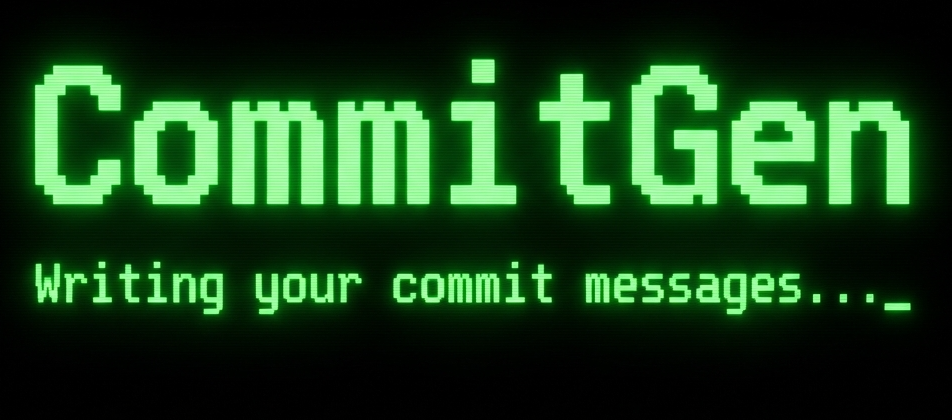

<div align="center">
  

  [](https://badge.fury.io/py/commitgen-ai)
  [](https://opensource.org/licenses/MIT)
  [](https://pypi.org/project/commitgen-ai/)
  [](https://ollama.ai)
  [](https://openrouter.ai)
</div>

**CommitGen** is an CLI tool that automatically generates conventional git commit messages for your staged changes. It analyzes your `git diff`, summarizes the changes, and uses local LLMs (via Ollama) or cloud providers (via OpenRouter) to write clean, descriptive commit messages.

## Features

- **LLM-Powered**: Uses advanced LLMs to understand your code changes.
- **Local First**: First-class support for [Ollama](https://ollama.ai) models (Llama 3, DeepSeek, Phi-3, etc.).
- **Cloud Option**: Supports **OpenRouter** for access to top-tier models (GPT-4, Claude 3.5, Llama 3.1 405B) and free models.
- **Smart Handling**: 
  - Automatically starts Ollama if it's not running.
  - Smart chunking for large diffs to fit within context windows of smaller models (1B-3B parameters).
  - CPU fallback for low-VRAM systems.
- **Configurable**: Easy-to-use CLI for configuration management.
- **Conventional Commits**: Generates messages following the Conventional Commits specification by default.

## Installation

### Prerequisites

- Python 3.8+
- Git
- [Ollama](https://ollama.ai) (optional, for local models)

### Install from PyPI

```bash
pip install commitgen-ai
```

### Install from Source

```bash
git clone https://github.com/souravtripathy/commitgen.git
cd commitgen
pip install -e .
```

## Quick Start

1.  **Initialize Configuration**:
    Run the interactive setup wizard to choose your provider and model.

    ```bash
    commitgen init
    ```

    - **Ollama**: It will detect installed models or help you download a starter model (`llama3.2:1b`).
    - **OpenRouter**: You'll need an API key from [openrouter.ai](https://openrouter.ai).

2.  **Stage Your Changes**:
    
    ```bash
    git add .
    ```

3.  **Generate a Commit**:

    ```bash
    commitgen commit
    ```

    Review the generated message and confirm to commit!

## Configuration

Manage your settings easily with the `config` command.

### View Configuration

```bash
commitgen config
# Or get specific value
commitgen config --get ollama.model
```

### Change Defaults

```bash
# Swith to a different Ollama model
commitgen config --set ollama.model=deepseek-r1:1.5b

# Change OpenRouter model
commitgen config --set openrouter.model=google/gemma-2-27b-it:free
```

### Reset Configuration

If you want to restore default settings:

```bash
commitgen config --reset
```

## Usage Tips

- **Auto-Commit**: Skip confirmation with `--auto` flag.
  ```bash
  commitgen commit --auto
  ```

- **Override Model**: Use a specific model for just one commit.
  ```bash
  commitgen commit --model qwen2.5:0.5b
  ```

- **Ollama Upgrade**: If your local model is failing due to memory, CommitGen will automatically try to run it on CPU.

## License

MIT
 License - see LICENSE file

## Author

[Sourav Tripathy](https://souravtripathy.com)
